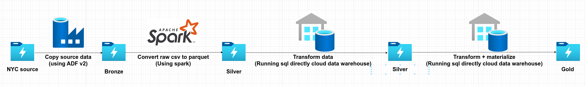

# NYC Taxi Data Analytics with Databricks

A multi-cloud data engineering solution for processing and analyzing NYC Taxi data (1.4B+ records) using Databricks. This project extends the [Azure-Databricks-NYC-Taxi-Workshop](https://github.com/microsoft/Azure-Databricks-NYC-Taxi-Workshop) with significant performance improvements by replacing Spark transformations with SQL Cloud Datawarehouse, expanded data range (2009-2017), and query optimizations using BROADCAST hints.

Implemented on both Azure and Google Cloud Platform (GCP), this project demonstrates cloud-agnostic data engineering patterns while leveraging each platform's native services for storage, data warehousing, and secret management.

## Modifications from Original Workshop

This repository includes several tweaks and enhancements compared to the original Azure-Databricks-NYC-Taxi-Workshop:

### 🚀 Replaced Transformation by Spark with Cloud SQL Data Warehouse

Switched from Spark to Databricks Cloud SQL Data Warehouse for transformations due to significant performance improvements over the original workshop's slower Spark-based approach

### 📊 Expanded Data Range for Better Benchmarking

Extended data processing from the original 2016-2017 range to include all NYC taxi data from 2009-2017, creating a massive 1-billion-record dataset for more comprehensive analysis and performance testing

### 🔍 Optimize Transformation Query for Big Dataset (Yellow Taxi)

Added query optimization techniques (by using BROADCAST join hint and UNION ALL query approach) for better performance and ad-hoc queries on the large Yellow Taxi dataset (1.37B records)

### Additional Enhancements

- Added utilities for converting between Databricks and Jupyter notebook formats
- Implemented synchronization scripts for notebooks and SQL files
- Added support for local development with VSCode

## Architecture

### High-Level Architecture


The architecture consists of several key components that are implemented differently across cloud providers:

#### Common Components

**Data Synchronization**  
Copies data from NYC source into cloud storage (stored as CSV)
- Azure: **Azure Data Factory**
- GCP: **Storage Transfer Service**

**Data Ingestion (Apache Spark)**  
Apache Spark on Databricks processes raw CSV data into optimized formats for analytics:
- Converts CSV to Parquet (reference data) and Delta Lake (trip data)
- Handles schema evolution and data partitioning
- Provides distributed processing for large-scale data transformation
- Enables efficient data processing with in-memory computation

**Secret Management**  
Stores sensitive information like secrets and credentials for connecting to Databricks and cloud services
- Azure: **Azure Key Vault**
- GCP: **Databricks secrets**

**Storage**  
Serves as the primary storage layer where we implement the medallion architecture (Bronze, Silver, Gold layers)
- Azure: **Azure Data Lake Storage Gen2**
- GCP: **Google Cloud Storage (GCS)**

**Cloud Data Warehouse**  
Provides the environment for data transformation and querying for reporting and analytics
- Azure: **Azure Synapse**
- GCP: **Google BigQuery**

### Batch Ingestion Flow



#### Storage Layer Details

| Layer | Format | Purpose | Example Tables |
|-------|--------|---------|---------------|
| **Bronze** | CSV | Raw data storage | yellow_taxi_trips_raw, green_taxi_trips_raw |
| **Silver** | Parquet/Delta | Processed data | taxi_zone_lookup (Parquet), yellow_taxi_trips_transform (Delta), green_taxi_trips_transform (Delta) |
| **Gold** | Delta Lake | Analytics-ready data | taxi_trips_mat_view |

## Setup

For a comprehensive setup guide, you can follow [module 01-Primer](https://github.com/microsoft/Azure-Databricks-NYC-Taxi-Workshop) in the original Azure-Databricks-NYC-Taxi-Workshop repository.

### Prerequisites

- Databricks workspace
- Azure Storage Account
- Python 3.11
- Databricks CLI configured
- VSCode with Databricks extensions installed:
  - [Databricks](https://marketplace.visualstudio.com/items?itemName=databricks.databricks) - Official Databricks extension for VSCode
  - [Databricks Notebooks](https://marketplace.visualstudio.com/items?itemName=paiqo.databricks-vscode) - For working with Databricks notebooks locally

### Installation

1. Clone this repository:
   ```bash
   git clone https://github.com/yourusername/Databricks-NYC-Taxi.git
   cd Databricks-NYC-Taxi
   ```

2. Install development dependencies:
   ```bash
   pip install -r requirements-dev.txt
   ```

3. Configure Databricks connection:
   ```bash
   databricks configure --token
   ```

4. Set up Azure Storage credentials in Databricks secrets:
   - Create a secret scope named "azure-databricks"
   - Add secrets for "storage-name" and "storage-key"

### Additional Setup Resources

- For setting up Databricks and VSCode integration:
  - [The Ultimate Setup for Databricks Development with VSCode](https://medium.com/@joelpantoja/the-ultimate-setup-for-databricks-development-with-vscode-490bae1b5a7a)

- For setting up Azure cloud using UI:
  - [Azure End-to-End Data Engineering Project - Part 1](https://rihab-feki.medium.com/azure-end-to-end-data-engineering-project-incremental-data-pipeline-part-1-ed3e55767513)
  - [Azure End-to-End Data Engineering Project - Part 2](https://rihab-feki.medium.com/azure-end-to-end-data-engineering-project-medallion-architecture-with-databricks-part-2-9abf1ab3dba0)

### Local Development to Databricks Synchronization

This project includes utilities to synchronize notebooks and SQL files from your local environment to Databricks workspace:

- Sync Jupyter notebooks to Databricks:
  ```bash
  ./sync_notebook.sh Workspace/CarsProject/jupyter-notebook/LoadDataYellowTaxi.ipynb /Users/me/LoadDataYellowTaxi
  ```

- Sync SQL transformation files to Databricks:
  ```bash
  ./sync_sql.sh Workspace/CarsProject/sql/transform /Users/me/sql/transform
  ```

## Dataset Statistics

The project processes a massive volume of NYC Taxi data:

### Trip Data

| Dataset | Time Period | Records | Raw CSV Size | Compressed Size (Delta) | Compression Ratio | Partitioning |
|:-------:|:-----------:|:-------:|:------------:|:-----------------------:|:-----------------:|:------------:|
| **Yellow Taxi Trips** | 2009-2017 | **1.37B** | 223.13GB (total) | 82.04GB | **2.6:1** | Year, Month |
| **Green Taxi Trips** | 2013-2017 | **59M** | (included above) | 3.73GB | **2.6:1** | Year, Month |

### Reference Data

| Dataset | Records | Format | Description |
|:-------:|:-------:|:------:|:------------|
| **Taxi Zone Lookup** | 265 | Parquet | Geographic zones for pickup/dropoff locations |
| **Vendor Lookup** | 3 | Parquet | Taxi service providers |
| **Payment Type Lookup** | 6 | Parquet | Methods of payment (cash, credit card, etc.) |
| **Rate Code Lookup** | 6 | Parquet | Different rate categories |
| **Trip Type Lookup** | 3 | Parquet | Types of trips (street-hail, dispatch, etc.) |

### Data Growth by Year

| Year | Yellow Taxi Records | Green Taxi Records | Total Records |
|:----:|:-------------------:|:------------------:|:-------------:|
| 2009 | ~170M | - | ~170M |
| 2010 | ~168M | - | ~168M |
| 2011 | ~176M | - | ~176M |
| 2012 | ~179M | - | ~179M |
| 2013 | ~173M | ~6M | ~179M |
| 2014 | ~165M | ~13M | ~178M |
| 2015 | ~146M | ~16M | ~162M |
| 2016 | ~131M | ~14M | ~145M |
| 2017 | ~62M | ~10M | ~72M |
| **Total** | **~1.37B** | **~59M** | **~1.43B** |

### Storage Container Sizes

| Container | Size |
|:---------:|:----:|
| Bronze | 223.13GB |
| Silver | 107.2GB |
| Gold | 124.04GB |

## Results and Benchmarks

### 🚀 SQL Query Optimization Results (Azure)

We conducted performance testing on complex join operations between taxi trip data and reference tables using different optimization techniques on Azure Databricks. The benchmark query ([1-join-yellow-taxi.sql](Workspace/CarsProject/sql/benchmark/1-join-yellow-taxi.sql)) analyzes trip patterns and payment distributions across different NYC taxi zones.

#### Optimization Techniques Tested

1. **Original vs. Union Query**: 
   - Original: Standard join approach
   - Union: Alternative implementation using UNION ALL to combine results

2. **BROADCAST Join Hint**:
   - Explicitly tells the query optimizer to broadcast smaller tables to all nodes

#### Performance Results

**Full Dataset Query (Complete Results)**

| Approach | Without BROADCAST | With BROADCAST | Improvement |
|:--------:|:-----------------:|:--------------:|:-----------:|
| Original Query | 23min 57s | 21min 27s | 10% faster |
| Union Query | 21min 16s | **13min 14s** | **45% faster** |

**Limited Dataset Query (LIMIT 1000)**

| Approach | Without BROADCAST | With BROADCAST | Improvement |
|:--------:|:-----------------:|:--------------:|:-----------:|
| Original Query | 8min 47s | 20.117s | 96% faster |
| Union Query | 9min 22s | **19.586s** | 96% faster |

#### Key Findings

- **Best Overall Performance**: BROADCAST hint combined with union query approach (13min 14s for full dataset)
- **Full Dataset Queries**: Combining BROADCAST and union query improves performance by 40% compared to original approach
- **Ad-hoc Queries (LIMIT 1000)**: BROADCAST hint delivers dramatic speedup (from minutes to seconds)
- **Recommendation**: Use BROADCAST hints for all queries, especially for interactive/ad-hoc analysis

### 🕒 Data Pipeline Execution Times (Yellow Taxi)

The following execution times were measured for processing the Yellow Taxi dataset (the largest dataset with 1.37B records) through the medallion architecture:

| Cloud Provider | Processing Step | Data Stage Transition | Execution Time | Details |
|:--------------:|:---------------:|:---------------------:|:--------------:|:--------|
| **Azure** | **Convert CSV to Parquet** | Bronze → Silver | 120min 39s | Initial data ingestion and conversion |
| | **Transform using Cloud SQL Warehouse** | Silver → Silver (transformed) | 9min 29s | Create table from transform SQL run directly in cloud datawarehouse |
| | **Materialize to Gold** | Silver → Gold | 10min | Final materialization step |
| **GCP** | **Convert CSV to Parquet** | Bronze → Silver | 91min | Initial data ingestion and conversion |
| | **Transform using Cloud SQL Warehouse** | Silver → Silver (transformed) | 15min 5s | Create table from transform SQL run directly in cloud datawarehouse |
| | **Materialize to Gold** | Silver → Gold | 14min 55.3s | Final materialization step |

### 🔄 Transform Method Evolution

We experimented with different transformation approaches before finding the optimal solution across both cloud platforms:

#### Azure Transformation Methods

| Transform Method | Execution Time | Details |
|:----------------:|:--------------:|:--------|
| **Raw Spark (Original Workshop)** | Too long to complete | Initial approach using raw Spark to process parquet files directly |
| **Hybrid Spark** ([TransformDataYellowTaxiSpark.ipynb](Workspace/CarsProject/jupyter-notebook/azure/transform-data/TransformDataYellowTaxiSpark.ipynb)) | >4 hours | Second approach with two phases: |
| | ~2.1 hours | - Parallel JDBC read using pickup_datetime partitioning to prevent data skew |
| | ~2.3 hours | - Spark-based transformation and storage write |
| **Databricks SQL Datawarehouse** | **9min 29s** | Final approach running SQL transformations directly in Databricks SQL |

#### GCP Transformation Methods

| Transform Method | Execution Time | Details |
|:----------------:|:--------------:|:--------|
| **Raw Spark (Original Workshop)** | Too long to complete | Initial approach using raw Spark to process parquet files directly |
| **Hybrid Spark** | 3.5 hours | Second approach with two phases: |
| | 2.4 hours | - Parallel JDBC read using pickup_datetime partitioning to prevent data skew |
| | 1.1 hours | - Spark-based transformation and storage write |
| **Databricks SQL Datawarehouse** | 14min 55s | Intermediate approach using Databricks SQL |
| **Cloud SQL Warehouse (BigQuery)** | **1min 20s** | Final approach running SQL transformations directly in BigQuery |

> **Note:** The dramatic performance improvements from Spark-based approaches (3.5+ hours) to SQL-based transformations (9min 29s on Azure Databricks SQL, 1min 20s on GCP BigQuery) demonstrate why we switched to cloud-native data warehousing solutions for these workloads. GCP's BigQuery showed particularly impressive performance with a 160x speedup over the Hybrid Spark approach.

### 💻 Computing Resources

The following computing environment was used for all benchmarks and data processing:

#### Databricks Compute Cluster

| Cloud Provider | Resource Type | Specification | Details |
|:--------------:|:-------------:|:-------------:|:--------|
| **Azure** | **Cluster Type** | Personal Compute | Single node, single worker |
| | **Runtime Version** | 16.2 | Apache Spark 3.5.2, Scala 2.12 |
| | **Node Type** | Standard_DS4_v2 | 28 GB Memory, 8 Cores |
| **GCP** | **Cluster Type** | Personal Compute | Single node, single worker |
| | **Runtime Version** | 16.2 | Apache Spark 3.5.2, Scala 2.12 |
| | **Node Type** | n2-highmem-8 | 64 GB Memory, 8 Cores |

#### SQL Warehouse

| Resource Type | Specification | Details |
|:-------------:|:-------------:|:--------|
| **Warehouse Name** | Serverless Starter Warehouse | Serverless type |
| **Cluster Size** | Small | 12 DBU/h/cluster |
| **Auto Stop** | Enabled | After 10 minutes of inactivity |
| **Scaling** | 2-4 clusters | 24 to 48 DBU capacity range |

## Project Structure

The project follows a modular structure to separate different stages of the data pipeline, with cloud-specific implementations:

```
.
├── README.md
├── requirements-dev.txt
├── sync_notebook.sh
├── sync_sql.sh
├── images/
│   ├── overall-architecture.png
│   └── batch-ingestion-flow.png
│
└── Workspace/
    ├── databricks_to_jupyter.py
    ├── jupyter_to_databricks.py
    ├── 01-General/
    │   └── 2-CommonFunctions.ipynb
    │
    └── CarsProject/
        ├── databricks-notebook/
        ├── jupyter-notebook/
        │   ├── azure/
        │   │   ├── analytics/
        │   │   │   └── Report.ipynb
        │   │   ├── load-data/
        │   │   │   ├── LoadDataGreenTaxi.ipynb
        │   │   │   ├── LoadDataYellowTaxi.ipynb
        │   │   │   └── LoadReferenceData.ipynb
        │   │   └── transform-data/
        │   │       ├── TransformData.ipynb
        │   │       └── TransformDataYellowTaxiSpark.ipynb
        │   ├── gcp/
        │   │   ├── analytics/
        │   │   │   └── Report.ipynb
        │   │   ├── load-data/
        │   │   │   ├── LoadDataGreenTaxi.ipynb
        │   │   │   ├── LoadDataYellowTaxi.ipynb
        │   │   │   └── LoadReferenceData.ipynb
        │   │   ├── transform-data/
        │   │   │   ├── TransformData.ipynb
        │   │   │   └── TransformDataBigquery.ipynb
        │   │   └── utils/
        │   │       ├── bigquery_databricks_utils.py
        │   │       └── bigquery_utils.py
        │   └── utils/
        └── sql/
            ├── benchmark/
            │   └── 1-join-yellow-taxi.sql
            └── transform/
                ├── databricks/
                │   ├── 1-transform-yellow-taxi.sql
                │   ├── 2-transform-green-taxi.sql
                │   └── 3-transform-create-materialize-view.sql
                └── bigquery/
                    ├── 1-bq-transform-yellow-taxi.sql
                    ├── 2-bq-transform-green-taxi.sql
                    └── 3-bq-transform-create-materialize-view.sql
```

Each notebook serves a specific purpose in the data pipeline, from ingestion to transformation to analysis.

## Future Enhancements

- **Implement Airflow Orchestration**: Automate and schedule Spark jobs and SQL transformations with Apache Airflow for improved workflow management
- **Adopt dbt for SQL Transformations**: Leverage dbt (data build tool) for better management, testing, and documentation of SQL transformation scripts
- **Establish CI/CD Pipeline**: Set up automated testing and deployment workflows to ensure code quality and streamline releases
- **Conduct Cloud Provider Comparison**: Evaluate Azure against other cloud platforms (AWS, GCP) for cost-effectiveness and performance benchmarks
