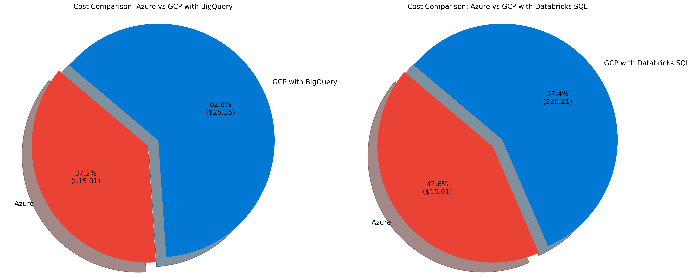
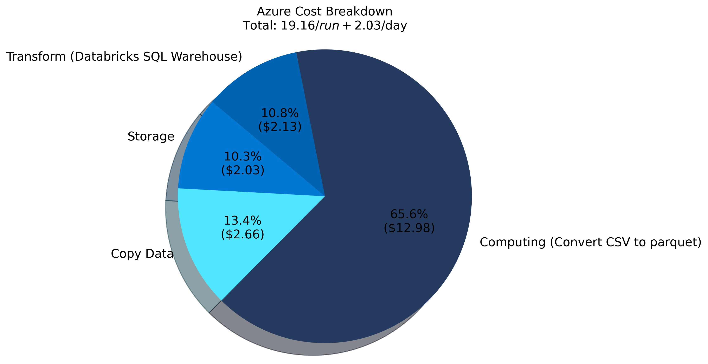
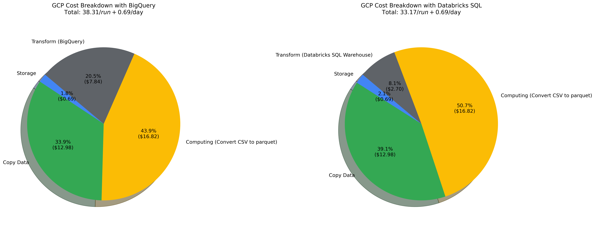
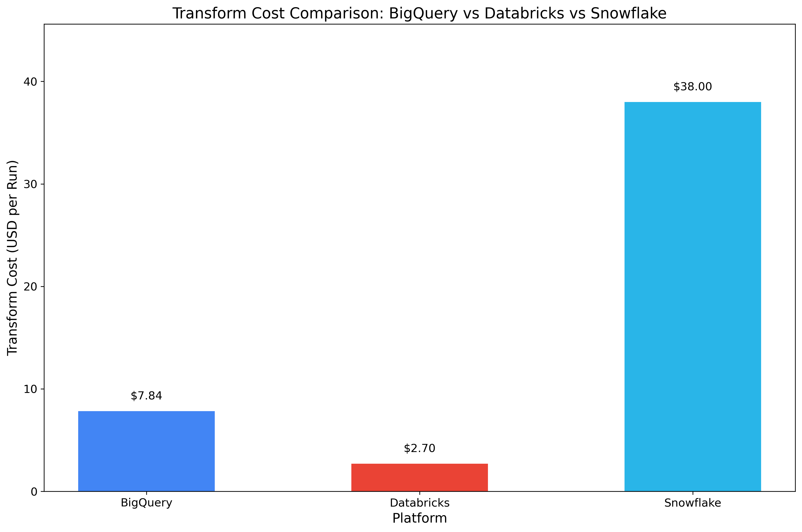
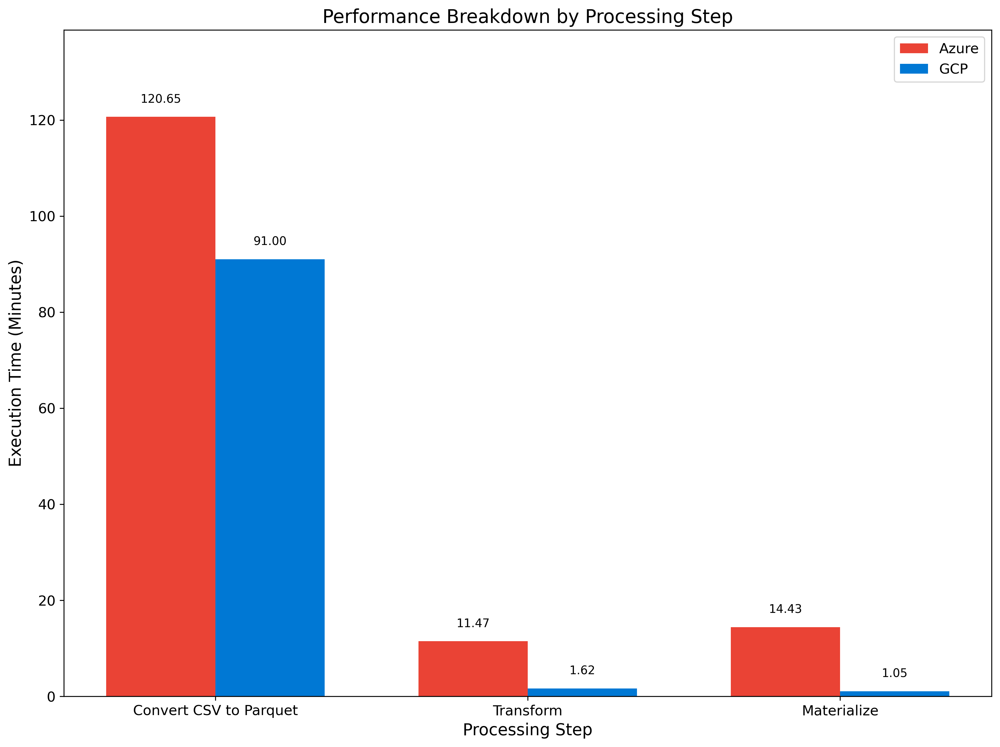

# NYC Taxi Data Analytics: Multi-Platform Comparison (Databricks, BigQuery, Snowflake)

## Table of Contents
- [Overview](#overview)
- [Modifications from Original Workshop](#modifications-from-original-workshop)
  - [🚀 Replaced Transformation by Spark with Cloud SQL Data Warehouse](#-replaced-transformation-by-spark-with-cloud-sql-data-warehouse)
  - [📊 Expanded Data Range for Better Benchmarking](#-expanded-data-range-for-better-benchmarking)
  - [🔍 Optimize Transformation Query for Big Dataset (Yellow Taxi)](#-optimize-transformation-query-for-big-dataset-yellow-taxi)
  - [💾 Change Delta Format File Writing Implementation](#-change-delta-format-file-writing-implementation)
- [Architecture](#architecture)
  - [High-Level Architecture](#high-level-architecture)
  - [Data Ingestion Flow](#data-ingestion-flow)
    - [Batch Ingestion](#batch-ingestion)
      - [Azure](#azure)
      - [GCP](#gcp)
- [Setup](#setup)
  - [Prerequisites](#prerequisites)
  - [Installation](#installation)
  - [Additional Setup Resources](#additional-setup-resources)
  - [Local Development to Databricks Synchronization](#local-development-to-databricks-synchronization)
- [Dataset Statistics](#dataset-statistics)
  - [Trip Data](#trip-data)
  - [Reference Data](#reference-data)
  - [Data Growth by Year](#data-growth-by-year)
  - [Storage Container Sizes](#storage-container-sizes)
- [Performance and Cost Visualizations](#performance-and-cost-visualizations)
  - [Cost Comparison Charts](#cost-comparison-charts)
    - [Overall Cost Comparison (Excluding Copy Data Costs)](#overall-cost-comparison-excluding-copy-data-costs)
    - [Detailed Cost Breakdown by Provider](#detailed-cost-breakdown-by-provider)
    - [Transform Cost Comparison Across Platforms](#transform-cost-comparison-across-platforms)
  - [Performance Comparison Charts](#performance-comparison-charts)
    - [Overall Performance Comparison](#overall-performance-comparison)
    - [Detailed Performance Breakdown](#detailed-performance-breakdown)
- [Cost Analysis](#cost-analysis)
  - [Key Cost Insights](#key-cost-insights)
  - [Key Observations](#key-observations)
- [Benchmark Results](#benchmark-results)
  - [Key Findings](#key-findings)
  - [🕒 Data Pipeline Execution Times (Yellow Taxi)](#-data-pipeline-execution-times-yellow-taxi)
  - [🔄 Transform Method Evolution](#-transform-method-evolution)
  - [🚀 SQL Query Optimization Results (Azure)](#-sql-query-optimization-results-azure)
- [Resources](#resources)
  - [💻 Computing Resources](#-computing-resources)
    - [Databricks](#databricks)
    - [Snowflake](#snowflake)
  - [🗄️ Storage](#️-storage)
- [Project Structure](#project-structure)
- [Delta Lake](#delta-lake)
  - [Troubleshooting](#troubleshooting)
  - [Best Practices](#best-practices)
- [Future Enhancements](#future-enhancements)

## Overview

An experimental data engineering project for processing and analyzing NYC Taxi data (1.4B+ records) across multiple platforms (Databricks, BigQuery, Snowflake) and cloud vendors (Azure, GCP) to compare performance and cost. This project extends the [Azure-Databricks-NYC-Taxi-Workshop](https://github.com/microsoft/Azure-Databricks-NYC-Taxi-Workshop) with significant performance improvements by replacing Spark transformations with cloud-native SQL data warehousing solutions, expanding the data range (2009–2017), and optimizing queries using BROADCAST hints.

This multi-platform approach demonstrates cloud-agnostic data engineering patterns while leveraging each platform's native services for storage, data warehousing, and secret management. The comprehensive cost and performance analysis helps data engineers make informed decisions when selecting platforms for large-scale data processing workloads.

## Modifications from Original Workshop

This repository includes several tweaks and enhancements compared to the original Azure-Databricks-NYC-Taxi-Workshop:

### 🚀 Replaced Transformation by Spark with Cloud SQL Data Warehouse

Switched from Spark to Databricks Cloud SQL Data Warehouse for transformations due to significant performance improvements over the original workshop's slower Spark-based approach

### 📊 Expanded Data Range for Better Benchmarking

Extended data processing from the original 2016-2017 range to include all NYC taxi data from 2009-2017, creating a massive 1-billion-record dataset for more comprehensive analysis and performance testing

### 🔍 Optimize Transformation Query for Big Dataset (Yellow Taxi)

Added query optimization techniques (by using BROADCAST join hint and UNION ALL query approach) for better performance and ad-hoc queries on the large Yellow Taxi dataset (1.37B records)

## Architecture

### High-Level Architecture


The architecture consists of several key components that are implemented differently across cloud providers:

#### Common Components

**Data Synchronization**  
Copies data from NYC source into cloud storage (stored as CSV)
- Azure: **Azure Data Factory**
- GCP: **Storage Transfer Service**

**Data Ingestion (Apache Spark)**  
Apache Spark on Databricks processes raw CSV data into optimized formats for analytics:
- Converts CSV to Parquet (reference data) and Delta Lake (trip data)
- Handles schema evolution and data partitioning
- Provides distributed processing for large-scale data transformation
- Enables efficient data processing with in-memory computation

**Secret Management**  
Stores sensitive information like secrets and credentials for connecting to Databricks and cloud services
- Azure: **Azure Key Vault**
- GCP: **Databricks secrets**

**Storage**  
Serves as the primary storage layer where we implement the medallion architecture (Bronze, Silver, Gold layers)
- Azure: **Azure Data Lake Storage Gen2**
- GCP: **Google Cloud Storage (GCS)**

**Cloud Data Warehouse**  
Provides the environment for data transformation and querying for reporting and analytics
- Azure: **Azure Synapse**
- GCP: **Google BigQuery**

### Data Ingestion Flow

#### Batch Ingestion

#### High Level Diagram

##### Azure


| Layer | Storage Type | Format | Purpose | Example Tables |
|-------|-------------|--------|---------|---------------|
| **Bronze** | Cloud Object Storage | CSV | Raw data storage | yellow_taxi_trips_raw, green_taxi_trips_raw |
| **Silver** | Cloud Object Storage | Parquet/Delta | Processed data | taxi_zone_lookup (Parquet), yellow_taxi_trips_transform (Delta) |
| **Gold** | Cloud Object Storage | Delta Lake | Analytics-ready data | taxi_trips_mat_view |

##### GCP


###### Storage Layer Details

| Layer | Storage Type | Format | Purpose | Example Tables |
|-------|-------------|--------|---------|---------------|
| **Bronze** | Cloud Object Storage | CSV | Raw data storage | yellow_taxi_trips_raw, green_taxi_trips_raw |
| **Silver** | BigQuery Table | N/A | Processed data | taxi_zone_lookup, yellow_taxi_trips_transform |
| **Gold** | BigQuery Table | N/A | Analytics-ready data | taxi_trips_mat_view |


## Setup

For a comprehensive setup guide, you can follow [module 01-Primer](https://github.com/microsoft/Azure-Databricks-NYC-Taxi-Workshop) in the original Azure-Databricks-NYC-Taxi-Workshop repository.

### Prerequisites

- Databricks workspace
- Azure Storage Account
- Python 3.11
- Databricks CLI configured
- VSCode with Databricks extensions installed:
  - [Databricks](https://marketplace.visualstudio.com/items?itemName=databricks.databricks) - Official Databricks extension for VSCode
  - [Databricks Notebooks](https://marketplace.visualstudio.com/items?itemName=paiqo.databricks-vscode) - For working with Databricks notebooks locally

### Installation

1. Clone this repository:
   ```bash
   git clone https://github.com/yourusername/Databricks-NYC-Taxi.git
   cd Databricks-NYC-Taxi
   ```

2. Install development dependencies:
   ```bash
   pip install -r requirements-dev.txt
   ```

3. Configure Databricks connection:
   ```bash
   databricks configure --token
   ```

4. Set up secrets for your cloud provider:

   #### For Azure:
   - Create an Azure Key Vault to store your secrets
   - In Databricks, create a secret scope named "azure-databricks" linked to your Azure Key Vault
   - Add the following secrets to your Azure Key Vault:
     - `warehouse-sql-host`: SQL warehouse host URL
     - `warehouse-sql-token`: SQL warehouse access token
     - `warehouse-sql-warehouseid`: SQL warehouse ID
     - `warehouse-sql-catalog-nyc`: SQL catalog name for NYC data
     - `warehouse-sql-schema-nyc`: SQL schema name for NYC data
     - `storage-name`: Azure Storage account name
     - `storage-key`: Azure Storage account key

   #### For GCP:
   - In Databricks, create a secret scope named "databricks-warehouse"
   - Add the following secrets directly in Databricks:
     - `sql-host`: SQL warehouse host URL
     - `sql-token`: SQL warehouse access token
     - `warehouseid`: SQL warehouse ID

### Additional Setup Resources

- For setting up Databricks and VSCode integration:
  - [The Ultimate Setup for Databricks Development with VSCode](https://medium.com/@joelpantoja/the-ultimate-setup-for-databricks-development-with-vscode-490bae1b5a7a)

- For setting up Azure cloud using UI:
  - [Azure End-to-End Data Engineering Project - Part 1](https://rihab-feki.medium.com/azure-end-to-end-data-engineering-project-incremental-data-pipeline-part-1-ed3e55767513)
  - [Azure End-to-End Data Engineering Project - Part 2](https://rihab-feki.medium.com/azure-end-to-end-data-engineering-project-medallion-architecture-with-databricks-part-2-9abf1ab3dba0)

### Local Development to Databricks Synchronization

This project includes utilities to synchronize notebooks and SQL files from your local environment to Databricks workspace:

- Sync Jupyter notebooks to Databricks:
  ```bash
  ./sync_notebook.sh Workspace/NYCTaxi/jupyter-notebook/LoadDataYellowTaxi.ipynb /Users/me/LoadDataYellowTaxi
  ```

- Sync SQL transformation files to Databricks:
  ```bash
  ./sync_sql.sh Workspace/NYCTaxi/sql/transform /Users/me/sql/transform
  ```

## Dataset Statistics

The project processes a massive volume of NYC Taxi data:

### Trip Data

| Dataset | Time Period | Records | Raw CSV Size | Compressed Size (Delta) | Compression Ratio | Partitioning |
|:-------:|:-----------:|:-------:|:------------:|:-----------------------:|:-----------------:|:------------:|
| **Yellow Taxi Trips** | 2009-2017 | **1.37B** | 223.13GB (total) | 82.04GB | **2.6:1** | Year, Month |
| **Green Taxi Trips** | 2013-2017 | **59M** | (included above) | 3.73GB | **2.6:1** | Year, Month |

### Reference Data

| Dataset | Records | Format | Description |
|:-------:|:-------:|:------:|:------------|
| **Taxi Zone Lookup** | 265 | Parquet | Geographic zones for pickup/dropoff locations |
| **Vendor Lookup** | 3 | Parquet | Taxi service providers |
| **Payment Type Lookup** | 6 | Parquet | Methods of payment (cash, credit card, etc.) |
| **Rate Code Lookup** | 6 | Parquet | Different rate categories |
| **Trip Type Lookup** | 3 | Parquet | Types of trips (street-hail, dispatch, etc.) |

### Data Growth by Year

| Year | Yellow Taxi Records | Green Taxi Records | Total Records |
|:----:|:-------------------:|:------------------:|:-------------:|
| 2009 | ~170M | - | ~170M |
| 2010 | ~168M | - | ~168M |
| 2011 | ~176M | - | ~176M |
| 2012 | ~179M | - | ~179M |
| 2013 | ~173M | ~6M | ~179M |
| 2014 | ~165M | ~13M | ~178M |
| 2015 | ~146M | ~16M | ~162M |
| 2016 | ~131M | ~14M | ~145M |
| 2017 | ~62M | ~10M | ~72M |
| **Total** | **~1.37B** | **~59M** | **~1.43B** |

### Storage Container Sizes

| Cloud Provider | Storage Type | Layer | Size |
|:--------------|:-------------|:-----|:----:|
| **Azure** | Azure Storage V2 | Raw | 223.13 GiB |
| | | Staging | 36.53 GiB |
| | | Transform | 131.07 GiB |
| | | **Total** | **390.73 GiB** |
|||||
| **GCP** | GCS | Raw | 223.13 GiB |
| | | Staging | 37.08 GiB |
| | BigQuery | Transform | 62.04 GiB (Physical) |
| | | **Total** | **322.25 GiB** |
|||||
| **Snowflake (GCP)** | GCS | Raw | 223.13 GiB |
| | | Staging | 37.08 GiB |
| | Snowflake | Transform | 97 GiB (Physical) |
| | | **Total** | **357.21 GiB** |

#### Storage Size Visualization


## Performance and Cost Visualizations

This section provides visual representations of the performance and cost metrics for our NYC Taxi data processing pipeline across different cloud platforms.

### Cost Comparison Charts

#### Overall Cost Comparison (Excluding Copy Data Costs)



This chart compares the total cost per run across different platforms, excluding copy data/egress costs. Azure offers the lowest cost at $19.16/run, while GCP costs vary depending on the transform option used: $38.31/run with BigQuery (left) or $33.17/run with Databricks SQL Warehouse (right).

#### Detailed Cost Breakdown by Provider



Azure's costs are primarily driven by compute resources, particularly the Databricks cluster which accounts for the majority of the expenses.



GCP's cost structure is shown with two options: using BigQuery for transformations (left, $38.31/run) and using Databricks SQL Warehouse (right, $33.17/run). Both options show significant portions going to copy data and computing (CSV to parquet conversion), but differ in their transform costs.

#### Transform Cost Comparison Across Platforms



This chart compares the transform costs across BigQuery, Databricks, and Snowflake. Databricks SQL Warehouse offers the most cost-effective solution at $2.70/run on GCP and $2.13/run on Azure, while Snowflake has the highest transform cost at $38.00/run.

### Performance Comparison Charts

#### Overall Performance Comparison


GCP outperforms Azure in total execution time, completing the entire pipeline in approximately 94 minutes compared to Azure's 147 minutes.

#### Detailed Performance Breakdown



The detailed breakdown shows that while both platforms have similar patterns (with data conversion taking the most time), GCP significantly outperforms Azure in the transformation and materialization steps.

## Cost Analysis

We tracked the costs associated with running our data pipeline across both cloud platforms:

| Cloud Provider | Resource Type | Operation | Service | Cost (USD) |
|:--------------:|:-------------:|:---------:|:-------:|:----------:|
| **Azure** | **Storage** | Daily Storage | Azure Storage v2 | **$1.785** (**$0.255** * 7) /day |
| | **Copy Data** | Data Transfer | Azure Data Factory | **$2.66/run** |
| | **Compute** | Convert CSV to Parquet | VM Instance | **$1.88/run** |
| | | | Databricks Cluster Spark Computing | **$11.10/run** |
| | | Transform Data | Databricks SQL Warehouse | **$2.13/run** |
| | **TOTAL** | | | **$19.16/run** + **$1.785/day** |
|||||
| **GCP** | **Storage** | Daily Storage | GCS + BigQuery | **$0.85** (**$0.57** + **$0.28**)/day |
| | **Copy Data** | Data Egress | Storage Transfer | **$12.98/run** |
| | **Compute** | Convert CSV to Parquet | VM Instance | **$2.60/run** |
| | | | Databricks Cluster Spark Computing | **$14.22/run** |
| | | Transform Data (Option 1) | BigQuery | **$7.84/run** |
| | | Transform Data (Option 2) | Databricks SQL Warehouse | **$2.70/run** |
| | **TOTAL (with BigQuery)** | | | **$38.31/run** + **$0.85/day** |
| | **TOTAL (with Databricks SQL)** | | | **$33.17/run** + **$0.85/day** |
|||||
| **Snowflake** | **Storage** | Daily Storage | GCS + Snowflake | **$1.011** (**$0.57** + **$0.441**)/day |
| | **Copy Data** | Egress Copy from GCP | Snowflake (AWS) | **$6.37/run** |
| | **Compute** | Transform Data | Snowflake | **$38.00/run** |
| | **TOTAL** | | | **$44.37/run** + **$1.011/day** |

### Key Cost Insights

- **Total Cost Comparison**: 
  - **Azure** offers the lowest total cost at **$19.16/run** (plus daily storage)
  - **GCP with Databricks SQL** costs **$33.17/run** (plus daily storage)
  - **GCP with BigQuery** costs **$38.31/run** (plus daily storage)
  - **Snowflake** costs **$44.37/run** (plus daily storage)

- **Storage Cost Comparison**: 
  - GCP storage cost breakdown: GCS ($0.57/day) + BigQuery ($0.28/day) = $0.85/day
  - **Note on time-travel features**: GCP storage and Bigquery costs include time-travel functionality (7-day retention period), preventing immediate deletion of objects even after bucket recreation. 
  Azure storage costs we have disabled time-travel and soft-delete features, so it's should multiply by 7 for same reference.
  - Snowflake GCP charges $20/TB/month, with our dataset (silver + gold) taking 97GB resulting in a storage cost of $1.94/month (approximately $0.063/day => $0.441 for 7-days time travel)
  - **Time-travel feature impact**: Storage costs are affected by time-travel retention periods, which vary by platform:
    - Azure and GCP have a default time-travel retention of 7 days
    - Snowflake Standard has a default time-travel retention of 1 day
    - Snowflake Enterprise has a default time-travel retention of 90 days
  
- **Copy Data Considerations**: When ingesting data, be mindful of data copy/egress charges when moving data between different cloud vendors. These charges can be significant ($12.98/run in our GCP implementation) and should be avoided when possible by keeping data processing within a single cloud ecosystem.

- **Transform Cost Comparison**: There are significant differences in transform costs across platforms:
  - Databricks SQL Warehouse is the most cost-effective option on both Azure ($2.13/run) and GCP ($2.70/run)
  - BigQuery is moderately priced at $7.84/run
  - Snowflake is the most expensive at $38.00/run, plus additional egress costs ($6.37/run) when copying data from GCP

### Key Observations

1. **Cost vs. Performance Tradeoff**: 
   - **Azure** offers the **lowest overall cost** ($19.16/run) but slower performance
   - **GCP** provides **fastest processing** but at a **higher cost** ($33.17-$38.31/run)
   - **Snowflake** has the **highest transform cost** ($38.00/run) with slowest performance transformation

2. **Platform Selection Considerations**:
   - For cost-sensitive workloads: Databricks SQL Warehouse on Azure offers the best value
   - For performance-critical workloads: BigQuery on GCP provides the fastest processing
   - For cross-cloud scenarios: Consider the additional copy data costs when moving data between platforms

## Benchmark Results

#### Key Findings

- **Best Overall Performance**: BROADCAST hint combined with union query approach (13min 14s for full dataset)
- **Full Dataset Queries**: Combining BROADCAST and union query improves performance by 40% compared to original approach
- **Ad-hoc Queries (LIMIT 1000)**: BROADCAST hint delivers dramatic speedup (from minutes to seconds)
- **Recommendation**: Use BROADCAST hints for all queries, especially for interactive/ad-hoc analysis

### 🕒 Data Pipeline Execution Times (Yellow Taxi)

The following execution times were measured for processing the Yellow Taxi dataset (the largest dataset with 1.37B records) through the medallion architecture:

| Platform | Cloud Provider | Processing Step | Data Stage Transition | Execution Time | Details |
|:--------:|:--------------:|:---------------:|:---------------------:|:--------------:|:--------|
| Databricks | **Azure** | **Convert CSV to Parquet** | Bronze → Silver | 120min 39s | Initial data ingestion and conversion |
| | | **Transform** | Silver → Silver (transformed) | 11min 28s | Create table from transform SQL run in Databricks SQL Warehouse |
| | | **Materialize** | Silver → Gold | 14min 26s | Final materialization step in Databricks SQL Warehouse |
| Databricks | **GCP** | **Convert CSV to Parquet** | Bronze → Silver | 91min | Initial data ingestion and conversion |
| | | **Transform** | Silver → Silver (transformed) | 1min 37s | Create table from transform SQL run in Cloud SQL Warehouse (BigQuery) |
| | | **Materialize** | Silver → Gold | 1min 3s | Final materialization step in Cloud SQL Warehouse (BigQuery) |
| Snowflake | **AWS(asia)** | **Transform** | Silver → Silver (transformed) | 26min 41s | Create table from transform SQL run in Snowflake |
| | | **Materialize** | Silver → Gold | 23min 54s | Final materialization step in Snowflake |
| Snowflake | **GCP (us-lowa)** | **Transform** | Silver → Silver (transformed) | 38min 48s | Create table from transform SQL run in Snowflake |
| | | **Materialize** | Silver → Gold | 34min 7s | Final materialization step in Snowflake |

### 🔄 Transform Method Evolution

We experimented with different transformation approaches before finding the optimal solution across both cloud platforms:

| Cloud Provider | Transform Method | Execution Time | Details |
|:--------------:|:----------------:|:--------------:|:--------|
| **Azure** | **Raw Spark (Original Workshop)** | Too long to complete | Initial approach using raw Spark to process parquet files directly |
| | **Hybrid Spark** ([AzureTransformDataYellowTaxiSpark.ipynb](Workspace/NYCTaxi/jupyter-notebook/azure/transform-data/AzureTransformDataYellowTaxiSpark.ipynb)) | >4 hours | Second approach with two phases: |
| | | ~2.1 hours | Parallel JDBC read using pickup_datetime partitioning to prevent data skew |
| | | ~2.3 hours | Spark-based transformation and storage write |
| | **Databricks SQL Datawarehouse** | **11min 28s** | Final approach running SQL transformations directly in Databricks SQL |
| | **Cloud SQL Warehouse (Azure Synapse)** | **`N/A`** | Unable to run due to compute capacity exceed |
|||||
| **GCP** | **Raw Spark (Original Workshop)** | Too long to complete | Initial approach using raw Spark to process parquet files directly |
| | **Hybrid Spark** ([GCPTransformDataYellowTaxiSpark.ipynb](Workspace/NYCTaxi/jupyter-notebook/gcp/transform-data/GCPTransformDataYellowTaxiSpark.ipynb)) | 3.5 hours | Second approach with two phases: |
| | | 2.4 hours | Parallel JDBC read using pickup_datetime partitioning to prevent data skew |
| | | 1.1 hours | Spark-based transformation and storage write |
| | **Databricks SQL Datawarehouse** | **14min 55s** | Intermediate approach using Databricks SQL |
| | **Cloud SQL Warehouse (BigQuery)** | **1min 20s** | Final approach running SQL transformations directly in BigQuery |

> **Note:** 
> 
> The dramatic performance improvements from Spark-based approaches (3.5+ hours) to SQL-based transformations demonstrate why we switched to cloud-native data warehousing solutions for these workloads.
> 
> In Azure, we can't run transform queries in Azure Synapse data warehouse due to compute capacity exceed. The best execution time (11min 28s) is achieved by running SQL transformations directly in Databricks SQL Data Warehouse.
> 
> In GCP, we can run transforms in BigQuery for optimized performance, achieving an impressive 1min 20s execution time.

### 🚀 SQL Query Optimization Results (Azure)

We conducted performance testing on complex join operations between taxi trip data and reference tables using different optimization techniques on Azure Databricks. The benchmark query ([1-join-yellow-taxi.sql](Workspace/NYCTaxi/sql/benchmark/1-join-yellow-taxi.sql)) analyzes trip patterns and payment distributions across different NYC taxi zones.

#### Optimization Techniques Tested

1. **Original vs. Union Query**: 
   - Original: Standard join approach
   - Union: Alternative implementation using UNION ALL to combine results

2. **BROADCAST Join Hint**:
   - Explicitly tells the query optimizer to broadcast smaller tables to all nodes

#### Performance Results

**Full Dataset Query (Complete Results)**

| Approach | Without BROADCAST | With BROADCAST | Improvement |
|:--------:|:-----------------:|:--------------:|:-----------:|
| Original Query | 23min 57s | 21min 27s | 10% faster |
| Union Query | 21min 16s | **13min 14s** | **45% faster** |

**Limited Dataset Query (LIMIT 1000)**

| Approach | Without BROADCAST | With BROADCAST | Improvement |
|:--------:|:-----------------:|:--------------:|:-----------:|
| Original Query | 8min 47s | 20.117s | 96% faster |
| Union Query | 9min 22s | **19.586s** | 96% faster |

## Resources

> **Note:** All resources are provisioned in the asia-southeast1 region (Singapore) in both GCP and Azure.

### 💻 Computing Resources

The following computing environment was used for all benchmarks and data processing:

#### Databricks

##### Compute Cluster

| Cloud Provider | Resource Type | Specification | Details |
|:--------------:|:-------------:|:-------------:|:--------|
| **Azure** | **Cluster Type** | Personal Compute | Single node, single worker |
| | **Runtime Version** | 16.2 | Apache Spark 3.5.2, Scala 2.12 |
| | **Node Type** | Standard_DS4_v2 | 28 GB Memory, 8 Cores |
| **GCP** | **Cluster Type** | Personal Compute | Single node, single worker |
| | **Runtime Version** | 16.2 | Apache Spark 3.5.2, Scala 2.12 |
| | **Node Type** | n2-highmem-8 | 64 GB Memory, 8 Cores |

##### SQL Warehouse

| Resource Type | Specification | Details |
|:-------------:|:-------------:|:--------|
| **Warehouse Name** | Serverless Starter Warehouse | Serverless type |
| **Cluster Size** | Small | 12 DBU/h/cluster |
| **Auto Stop** | Enabled | After 10 minutes of inactivity |
| **Scaling** | 1-1 clusters | 12 to 12 DBU capacity range |

##### Provision notes for cost optimizing

When provisioning Databricks computing clusters, consider these cost-optimization factors:

- **Spot Instances**: Evaluate whether to use spot instances for significant cost savings on non-critical workloads.
  
- **Photon Engine**: Enable the Photon engine to optimize Spark SQL performance. This significantly impacts DBU pricing - for example, an n2-highmem-4 instance costs 1.96 DBU/hour with Photon versus 0.96 DBU/hour without Photon.
  
- **Compute Type Selection**: Choose the appropriate compute type based on your workload requirements:
  - All-purpose compute: For interactive development
  - Job compute: For scheduled production workloads
  - SQL compute: For data warehousing operations
  - SQL serverless: For on-demand query processing
  
Each option offers different pricing models and performance characteristics.

#### Snowflake

##### Compute Warehouse

| Specification | Details |
|---------------|---------|
| **Size** | Medium |
| **Type** | Snowpark-optimized |
| **Resource Constraint** | MEMORY_16X |
| **Compute Resources** | 32 GB Memory, 8 cores per node, 4 nodes (total: 256 GB Memory, 32 cores) |

### 🗄️ Storage

| Cloud Provider | Storage Type | Configuration | Details |
|:--------------:|:------------:|:-------------:|:--------|
| **Azure** | **Azure Data Lake Storage Gen2** | Standard tier | Hierarchical namespace enabled |
| **GCP** | **Google Cloud Storage** | Standard storage class | Non-hierarchical namespace (flatten) |

## Project Structure

The project follows a modular structure to separate different stages of the data pipeline, with cloud-specific implementations:

```
.
├── README.md
├── requirements-dev.txt
├── sync_sql.sh
├── images/
│   ├── overall-architecture.png
│   └── batch-ingestion-flow.png
│
└── Workspace/
    ├── databricks_to_jupyter.py
    ├── jupyter_to_databricks.py
    ├── 01-General/
    │   └── 2-CommonFunctions.ipynb
    │
    └── NYCTaxi/
        ├── jupyter-notebook/
        │   ├── azure/
        │   │   ├── analytics/
        │   │   │   └── Report.ipynb
        │   │   ├── load-data/
        │   │   │   ├── AzureLoadDataGreenTaxi.ipynb
        │   │   │   ├── AzureLoadDataYellowTaxi.ipynb
        │   │   │   └── AzureLoadReferenceData.ipynb
        │   │   └── transform-data/
        │   │       ├── AzureTransformData.ipynb
        │   │       └── AzureTransformDataYellowTaxiSpark.ipynb
        │   │
        │   └── gcp/
        │       ├── analytics/
        │       │   └── Report.ipynb
        │       ├── create-secret.sh
        │       ├── load-data/
        │       │   ├── GCPLoadDataGreenTaxi.ipynb
        │       │   ├── GCPLoadDataYellowTaxi.ipynb
        │       │   └── GCPLoadReferenceData.ipynb
        │       ├── transform-data/
        │       │   ├── GCPTransformData.ipynb
        │       │   ├── GCPTransformDataBigquery.ipynb
        │       │   └── GCPTransformDataYellowTaxiSpark.ipynb
        │
        └── sql/
            ├── benchmark/
            │   └── 1-join-yellow-taxi.sql
            └── transform/
                ├── azure/
                │   └── databricks/
                │       ├── 1-transform-yellow-taxi.sql
                │       ├── 2-transform-green-taxi.sql
                │       └── 3-transform-create-materialize-view.sql
                └── gcp/
                    ├── bigquery/
                    │   ├── 1-bq-transform-yellow-taxi.sql
                    │   ├── 2-bq-transform-green-taxi.sql
                    │   ├── 3-bq-transform-create-materialize-view.sql
                    │   └── gcp_billing_by_label.sql
                    └── databricks/
                        ├── 1-transform-yellow-taxi.sql
                        ├── 2-transform-green-taxi.sql
                        └── 3-transform-create-materialize-view.sql
```

Each component in this structure serves a specific purpose in the data pipeline:

- **Notebooks**: Organized by cloud provider (Azure/GCP) and pipeline stage (load/transform/analytics)
- **SQL Scripts**: Separated by cloud provider and execution environment (Databricks/BigQuery)
- **Utility Scripts**: For conversion between notebook formats and synchronization with Databricks
- **Configuration Files**: For project settings and environment setup

## Delta Lake

### Troubleshooting

When working with Delta Lake tables across different environments (Databricks and BigQuery), you may encounter these common issues:

**Metadata Schema Errors in BigQuery**

If you encounter an error like this when reading Delta Lake tables in BigQuery:
```
Error while reading table: green_taxi_trips_raw, error message: Failed to find the required variable metaData.partitionColumns.list.element in the delta lake checkpoint schema.
```

Fix by running this command in Databricks:
```sql
ALTER TABLE <table_name> SET TBLPROPERTIES ('delta.minReaderVersion' = '3', 'delta.minWriterVersion' = '7');
```

**Missing or Deleted Files Errors**

If you encounter errors about missing or deleted files after running Spark write operations in a table folder:

Fix by running this command in Databricks:
```sql
FSCK REPAIR TABLE <table_name>;
```

**Accidentally Deleted _delta_log Folder**

To recover a Delta table after accidentally deleting its `_delta_log` folder:

```python
%sql
from delta.tables import *
deltaTable = DeltaTable.convertToDelta(spark, f"parquet.`<table_data_dir_path>`", "trip_year STRING, trip_month STRING")
```

Specify your partition columns (e.g., `trip_year STRING, trip_month STRING`) based on your table's partitioning scheme.

**Zero Row Count**

To fix a Delta table showing zero rows despite having data:

1. Back up the existing `_delta_log` folder.

2. Remove the corrupted `_delta_log` folder.

3. Rebuild the Delta table from underlying Parquet files by following **Accidentally Deleted _delta_log Folder** steps above.

### Best Practices

You can follow link [Databricks Delta Lake best practices](https://docs.databricks.com/aws/en/delta/best-practices) for best practices with delta lake.

### Schema Management

Delta Lake provides powerful schema management capabilities that standard Parquet files lack:

- **Schema Enforcement**: Protects data quality by rejecting writes with incompatible schemas
  - Prevents data corruption by validating all data against the table's schema
  - Rejects writes that don't match the schema, unlike Parquet which accepts any schema
  - Acts as a safeguard against accidental schema changes that could break downstream processes
  
- **Schema Evolution**: Enables tables to adapt to changing data requirements over time
  - Supports adding new columns to accommodate new data attributes
  - Allows changing column data types (with certain compatibility restrictions)
  - Handles nested data structures and complex schema changes
  - Maintains backward compatibility with existing queries

These features make Delta Lake particularly valuable for long-running data pipelines where data schemas may evolve over time, and data quality is critical.

### Storage Optimization

#### Choosing built-in cloud object storage or using delta lake

When designing your data storage strategy, you have two main options to consider:

- **Option 1: Standard Parquet with Cloud Storage Features**
  - Use standard Parquet format files
  - Rely on cloud provider's built-in features:
    - Time-travel recovery
    - Object versioning
    - Soft-delete functionality
  - Simpler implementation but potentially higher storage costs

- **Option 2: Delta Lake without Cloud Storage Features**
  - Use Delta Lake format
  - Disable redundant cloud storage features:
    - Turn off soft delete functionality
    - Disable time-travel recovery features
    - Disable blob version ID tracking
  - These features are already provided by Delta Lake's native versioning and time travel capabilities
  - Avoid duplicate functionality and reduce storage costs

Choose between these options based on your specific needs and requirements. Delta Lake provides more control over versioning and recovery while potentially optimizing storage costs when configured properly.

- **File Management Strategy**: While using simple append mode is convenient for development, consider implementing a tiered storage approach for production:
  - Keep only the latest version of parquet files in your primary storage location
  - Automatically move older versions to backup/cold/archive storage tiers
  - Leverage Delta Lake's version restore mechanism to retrieve historical data when needed
  
  This approach optimizes storage costs while maintaining the ability to access historical data through Delta Lake's time travel capabilities.

## Future Enhancements

- **Implement Airflow Orchestration**: Automate and schedule Spark jobs and SQL transformations with Apache Airflow for improved workflow management
- **Adopt dbt for SQL Transformations**: Leverage dbt (data build tool) for better management, testing, and documentation of SQL transformation scripts
- **Establish CI/CD Pipeline**: Set up automated testing and deployment workflows to ensure code quality and streamline releases
- **Conduct Cloud Provider Comparison**: Evaluate Azure against other cloud platforms (AWS, GCP) for cost-effectiveness and performance benchmarks
